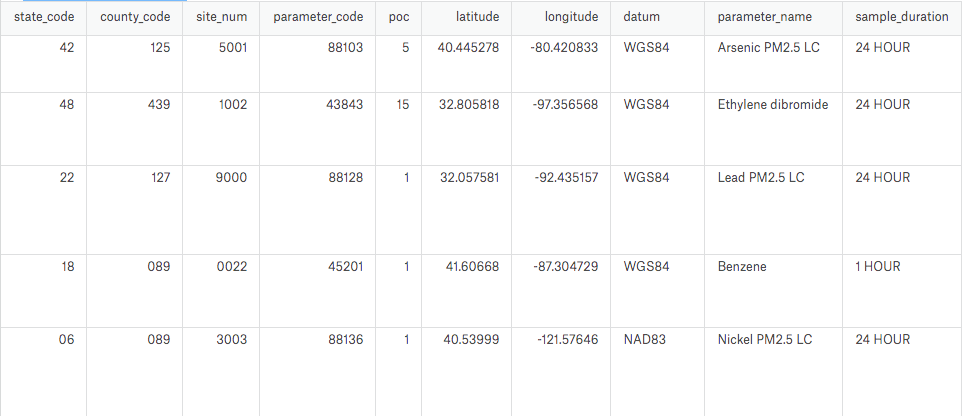

# PySpark for Data Processing

Code for my presentation: Using PySpark to Process Boat Loads of Data

Download the slides from Slideshare: [https://www.slideshare.net/robertdempsey/using-pyspark-to-process-boat-loads-of-data](https://www.slideshare.net/robertdempsey/using-pyspark-to-process-boat-loads-of-data).

## Dataset

This code uses the [Hazardous Air Pollutants](https://www.kaggle.com/epa/hazardous-air-pollutants) dataset from Kaggle.

### Stats

* Data source: United States Environmental Protection Agency
* Number of Files: 1
* Compressed Size: 658.5MB
* Uncompressed Size: 2.4GB

### Content

The daily summary file contains data for every monitor (sampled parameter) in the Environmental Protection Agency (EPA) database for each day. This file will contain a daily summary record that is: 1. The aggregate of all sub-daily measurements taken at the monitor. 2. The single sample value if the monitor takes a single, daily sample (e.g., there is only one sample with a 24-hour duration). In this case, the mean and max daily sample will have the same value.

### Field Descriptions

1. State Code: The Federal Information Processing Standards (FIPS) code of the state in which the monitor resides.
2. County Code: The FIPS code of the county in which the monitor resides.
3. Site Num: A unique number within the county identifying the site.
4. Parameter Code: The AQS code corresponding to the parameter measured by the monitor.
5. POC: This is the “Parameter Occurrence Code” used to distinguish different instruments that measure the same parameter at the same site.
6. Latitude: The monitoring site’s angular distance north of the equator measured in decimal degrees.
7. Longitude: The monitoring site’s angular distance east of the prime meridian measured in decimal degrees.
8. Datum: The Datum associated with the Latitude and Longitude measures.
9. Parameter Name: The name or description assigned in AQS to the parameter measured by the monitor. Parameters may be pollutants or non-pollutants.
10. Sample Duration: The length of time that air passes through the monitoring device before it is analyzed (measured). So, it represents an averaging period in the atmosphere (for example, a 24-hour sample duration draws ambient air over a collection filter for 24 straight hours). For continuous monitors, it can represent an averaging time of many samples (for example, a 1-hour value may be the average of four one-minute samples collected during each quarter of the hour).
11. Pollutant Standard: A description of the ambient air quality standard rules used to aggregate statistics. (See description at beginning of document.)
12.Date Local: The calendar date for the summary. All daily summaries are for the local standard day (midnight to midnight) at the monitor.
13. Units of Measure: The unit of measure for the parameter. QAD always returns data in the standard units for the parameter. Submitters are allowed to report data in any unit and EPA converts to a standard unit so that we may use the data in calculations.
14. Event Type: Indicates whether data measured during exceptional events are included in the summary. A wildfire is an example of an exceptional event; it is something that affects air quality, but the local agency has no control over. No Events means no events occurred. Events Included means events occurred and the data from them is included in the summary. Events Excluded means that events occurred but data form them is excluded from the summary. Concurred Events Excluded means that events occurred but only EPA concurred exclusions are removed from the summary. If an event occurred for the parameter in question, the data will have multiple records for each monitor.
15. Observation Count: The number of observations (samples) taken during the day.
16. Observation Percent: The percent representing the number of observations taken with respect to the number scheduled to be taken during the day. This is only calculated for monitors where measurements are required (e.g., only certain parameters).
17. Arithmetic Mean: The average (arithmetic mean) value for the day.
18. 1st Max Value: The highest value for the day.
19. 1st Max Hour: The hour (on a 24-hour clock) when the highest value for the day (the previous field) was taken.
20. AQI: The Air Quality Index for the day for the pollutant, if applicable.
21. Method Code: An internal system code indicating the method (processes, equipment, and protocols) used in gathering and measuring the sample. The method name is in the next column.
22. Method Name: A short description of the processes, equipment, and protocols used in gathering and measuring the sample.
23. Local Site Name: The name of the site (if any) given by the State, local, or tribal air pollution control agency that operates it.
24. Address: The approximate street address of the monitoring site.
25. State Name: The name of the state where the monitoring site is located.
26. County Name: The name of the county where the monitoring site is located.
27. City Name: The name of the city where the monitoring site is located. This represents the legal incorporated boundaries of cities and not urban areas.
28. CBSA Name: The name of the core bases statistical area (metropolitan area) where the monitoring site is located.
29. Date of Last Change: The date the last time any numeric values in this record were updated in the AQS data system.

### Dataset Preview




## Spark in Docker

To make running the code easy Spark will be run inside of a Docker image. This project uses the Spark containers from [Getty Images](https://hub.docker.com/r/gettyimages/spark/). The included docker compose file will create two containers for a 2-node cluster:

1. Master node
2. Worker node

When a Spark job is running you will have access to the Spark Web UI. Once the jobs are finished it's gone baby.

To run the Docker containers ensure you have Docker installed and running.

## Run the Code

Checkout the code
```
git checkout git@github.com:rdempsey/pyspark-for-data-processing.git
```

Download the dataset, unzip and place the csv file in the project's data folder
```
cp ~/Downloads/epa_hap_daily_summary.csv ./data/epa_hap_daily_summary.csv
```

Run the Docker Compose file
```
docker-compose up --build -d
```

Open a bash shell in the container
```
docker exec -it pysparkfordataprocessing_master_1 /bin/bash
```

Run one of the scripts in the `scripts` folder
```
bin/spark-submit /scripts/q1_most_polluted_state.py
```

All output will be save into the `data` folder.